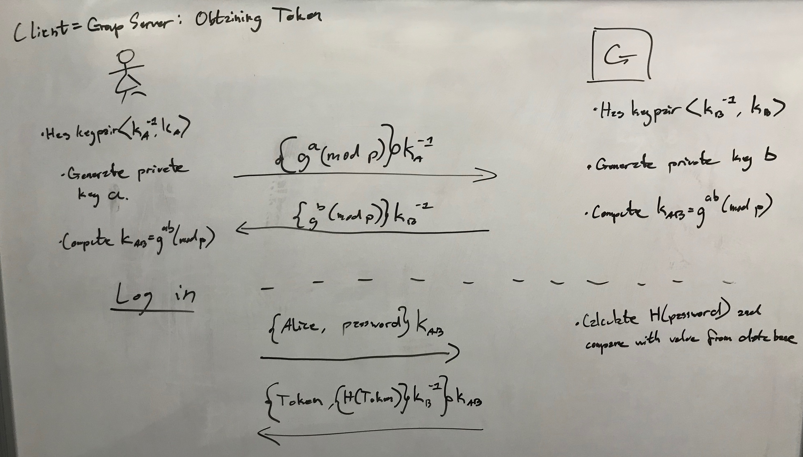

## Mustafa Alazzawi, James Tomko, Tanner Stauffer
## mua31, jat190 , tas202
## CS1653
## 7/5/19
# Phase 3 Report
### Introduction

In this phase of the project we are adding security to our group-based file-sharing system. Many of the security techniques implemented were learned in class to address specific threats. Some of the security mechanisms and protocols that we used include: password-based authentication systems, asymmetric private key signatures, challenge / response authentication protocol, and the use of hybrid cryptography. A password-based authentication system is commonly used to assure the servers of the users identity. Similarly, asymmetric private key signatures are a useful technique to provide integrity of one entity to another. The challenge / response protocol is used to verify that a particular entity is trustworthy. Finally, hybrid cryptography efficiently secures communications between two entities by securely sharing symmetric keys. Here are the various ways we used these techniques to defend against threats to our server:

### Preventing Unauthorized Token Issuance (T1)

The unauthorized token issuance threat is the concern that an untrusted user will gain access to a token that is not theirs. This could violate the confidentiality, integrity, and availability of the system. Suppose Alice has access to Bob’s token. From this she can log in to the file server as Bob and view his private files, violating confidentiality. Similarly, she can log into the group server as Bob and modify the groups he is part of. Since the server believes the current user is Bob, however, it is in fact actually Alice this is a violation of integrity. Additionally, Alice could modify the groups that are owned by Bob, adding and deleting members. This violates availability, since users who were removed will no longer be able to access the group’s files. Since the only thing required to access a person’s token is their public username, Alice can unrightfully obtain Bob’s token, leading to these problems.

In order to prevent users from obtaining another user’s token, we implement a password-based authentication system. Users need to provide both their public username and a private password when initially requesting a token from the group server. The group server stores the hash of the password with the user information. When a user requests a token, they provide their username and password. The group server hashes the received password and looks up the user in it’s database. If the stored has matches the calculated hash, the user is deemed to be authenticated and the token is provided. If the hashes are different, then the server rejects the authentication request. Passwords will be generated by the group server when a new user is created, then they will be hand-distributed by the admin.

This is an effective approach to stopping the unauthorized token issuance threat because a given user can no longer easily access another user’s token. Provided that each user keeps their password private and when logging in the user enters the correct password, then the server can confirm the user is who they say they are. This is secure as long as it is not possible for users to learn another user’s password. This is correct because a valid (username, password) pair will match the group server’s database, giving the user his token, and an invalid combination will not.

### Preventing Token Modification (T2)

Tokens contain important information such as who you are, what groups you own and what groups you are a member of. If the user was able to modify his/her token then he/she will be able to access and modify files that may not belong to him/her. For example; If Bob does not belong to group A, but he modified the token to add himself to group A, then he can access all files in group A with upload, download, and delete permissions.

Group server will send the client a signed hash of their token along with the token (signed with the group servers private key). This signed hash will be presented to a trusted file server when the token is presented. Now the file server will know the token could not have been modified because the user could not have signed the token with the group servers private key. Diagram below.

The file server will verify the token before any modifications; it would be impossible to have any access with modified token, since the signature will only match the unmodified version. And a modified token will be recognizable since it will not be correctly signed with the group server’s private key.

### Protecting Against Unauthorized File Servers (T3)

The threat of unauthorized file servers means that since their are N files servers, it is possible for a user attempting to log into a file server to be misdirected into some malicious unknown file server.

Example: If Bob created and bugged the client application to send users to file server S’ (a non-trusted file server), and Alex logs into S’, then all Alex files are not secure and confidential anymore. They can be accessed by Bob.

Each installed file server S will generate a key pair. The public key will be available to clients out of band. On each connection, the server will present the user with it’s public key. For the first connection, the user must verify that the keys match manually, but if they do match, it can be saved and compared automatically on subsequent connections. Each time the client connects, they will encrypt a timestamp and send it to the server. The server will have one chance to respond with the correctly decrypted timestamp + 1. If the server does this, we can be reasonably sure that it has the corresponding private key, since only the corresponding private key can decrypt a message encrypted with its public key.

It’s effective because the public key will be delivered to the client out of band by trusted individuals. Any message encrypted by the client using the public key will only be decrypted by the corresponding private key. Returning the decrypted message to client will assure the client that the public key is valid. Because only the corresponding private key would match with the given public key, we know the server is trustworthy.

### Preventing Eavesdropping (T4)
We are assuming our communication lines are being listened to by
‘passive attackers.’ This is a threat because we are sending important
information like tokens, passwords, and keys on these lines. Any
eavesdropper could listen and gather this valuable information. For
instance, if Eve could obtain the token of Alex through the network then
Eve would have access as Alex’s user account.

To prevent eavesdroppers from viewing the transmitted information, we
will use a signed Diffie-Hellman key exchange when communicating between
the client and the servers, as shown in the diagrams below. The
exchanged secret will be used as the key to a symmetric cipher, allowing
for efficient encryption and decryption. Only the client and the server
will be able to create this key, since only they will have the
corresponding private keys from which it is derived.

By exchanging keys in this manner, we can prevent eavesdropping, since
the shared secret cannot be calculated from the two public keys. This is
also resistant to man-in-the-middle attacks, since the exchanged public
keys are signed. Since all further commincations are encrypted with this
secret, it should be sufficient to have secure communication between the
hosts.

### Client <--> Group Server Overview
* [T1] When a new user is created, the group server will generate that user a password. This password will be manually distributed to the user.
* [T1]
* [T2]
* [T4]

### Client <--> File Server Overview
* [T2]
* [T3]
* [T4]

### Conclusion
//closing para:  discussing the interplay between your proposed mechanisms, and commenting on the design process that your group followed  …more on pdf

	FINISH AFTER IMPLEMENTATION****
