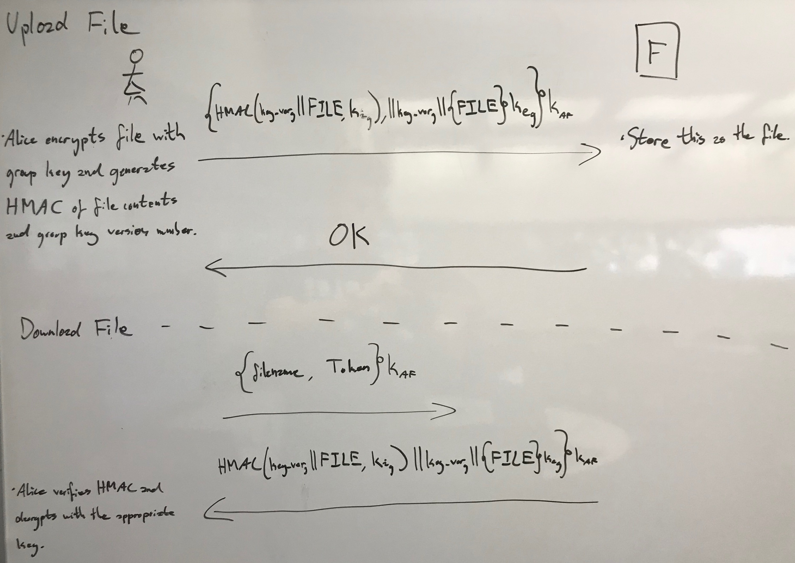

## Mustafa Alazzawi, James Tomko, Tanner Stauffer
## mua31, jat190 , tas202
## CS1653
## 7/22/19
# Phase 4 Report
### Introduction

In this phase of the project we are adding more security to our group-based file-sharing system. In the this phase we will address threats mostly pertaining to active attacks to communications and a faulty file server. Many of the security techniques implemented were learned in class to address specific threats. Some of the security mechanisms and protocols that we used include: message authentication, managing groupkeys, and limiting the abilities of compromised tokens. Our message authentication basically means we will check each messages ordering with a sequence number, and will make sure it is not able to be replayed for information or modified with a signed hash of the message. Next, to limit the damage that would be done by a faulty file server releasing information, all files stored will now be encrypted by the group that stores its group key. Group keys need to be effectively managed because of members joining and leaving. Lastly, if a faulty server were to give a user's token to another user we will prevent further use by limiting each issued token to only that particular server.

### Message Reorder, Replay, and Modification (T5)

The adversary can cause threats by reordering, replaying and/or, modifying messages. If the attacker reorders a message, 
they can possibly execute a sequence of operations that should not occur. On a replay attack, an adversary can keep resending
messages to obtain confidential information. Lastly, an attacker can modify a message and the receiver won't get the actual 
messages that they were meant to receive causing incongruence.

For the reorder attack after establishing a secure connection between client and the group server and client and the file server,
the sender will start sequence number that will be encrypted and sent with each message. In our case the client will send it 
to the servers. Each message will be checked before processed the requests. Any message not within the sequence will be
dropped. For example, if the receiver expects to get message with sequence 47 and got a number < or > than expected, then we will
have detected a replay attack and will aborted the connection. For the modification attack, we will send a copy of each message that is 
hashed and signed. Then the receiver can do these same steps to make sure the message is unmodified. Last, replay attacks will not work
against our system because we already are encrypting each message with a session diffie-hellman encryption.
  
For the replay and modification attack we already established authentication connection between client-group server and
between client-file server using Diffie Hellman. The client using groups server and file server public keys to exchange
the agreed key. After that all messages will be signed and encrypted. And using the sequence number and signed hashed messages to 
detect reorders or modifications are effective ways to address this threat.

### File Leakage (T6)

The threat of file leakage comes from the issue that we can't trust the fileservers. If they were to leak the files they have stored on them, then our system would no longer be confidential. Currently in our implementation files are stored on the file server in plaintext, and if they were leaked would be readable to anyone. This is a major issue if we need the stored information to be kept private.

To fix this threat a few steps need to be taken. First, when a group is formed a group key will be generated on the group server and stored in each member of the group's token when they retrieve it. The algorithm to generate it will be Ki = h(longterm_Secret || i), and only the trusted group server will know the longterm_Secret so that no member of the group will know it and be able to predict future keys. Whenever a group removes a member, the old group key will be saved in an hashmap of version to key on the group server as well as on the members tokens. Then a new group key will be generated so that the member of the group who was removed will o longer know the current key. Now, whenever a file is uploaded from the client to the file server, they will first encrypt the file with the group key so that if that file server were to leak it, then no one would be able to get the plaintext except for the members of the group. The last change made is when a member downloads the file they will decrypt it with the correct version of the group key.

This implementation is effective because it prevents leaked files from being read by the public. The group key can be a bit of work to manage and may cause some issues, but overall is an effective way of addressing the issue. Some issues that arise from this implementation are that since files can be stored on the file server encrypted will old versions of the group key it is possible for members who have been removed from a group to decipher these leaked files and sabotage the group. However this is backwards secrecy and does not need to be addressed yet in this phase of the project.

### Token Theft (T7)
It is also possible that a file server may steal a user's token and
attempt to impersonate that user. For example, if Bob connects to a file
server using a token he received from the group server, the file server
may store this token without Bob's knowledge. It could then give this
token to another user, who would be able to connect to any file server,
pretending to be Bob. This other user does not need to know Bob's
password to obtain his token, since Bob already entered it before
originally connecting. The user would have access to Bob's files, which
is probably not a good thing.

To prevent this kind of token theft, we implement a mechanism where the
user tells the group server which file server they would like to connect
to, and it is marked in the token. File servers will then only accept
tokens that are marked for them. This prevents leaked tokens from being
used anywhere except for on the server that stole them. To implement
this, the user can specify a file server's public key when requesting a
token, and the group server will include this key in the token. Then,
when connecting to a file server, if the token does not contain its
public key, it will not allow the user to connect.

This addition should mitigate the damage that can be caused by token
theft. Suppose a file server steals a token under this system, and gives
it to another user. If that user attempts to use the token to connect to
another file server, it will be rejected because it does not contain the
correct public key. The user cannot modify the key that is contained in
the token, since doing so would cause the group server's signature to
become invalid, also resulting in rejection. Use of the stolen token is
limited to the file server that stole it, since that server is the only
one that has a key that matches what is contained in the token.

### Client <----> Group Server Overview
* [T5] All messages include a sequence number and a signed hash of the contents of the message. The sequence number will be a randomly generated integer by the client that is incremented with each message sent between client and GS. Both of these will be encrypted with the DH shared key.
* [T6] When create group is called, the GS will generate a groupkey based on the algorithm described above. The GS stores this mapping and also places this mapping on a group members token the next time the token is update. (Not part of picture). When remove user is called, the GS will now also generate update to the key, again based on the algorithm above.
* [T7] As seen in the picture, the FS public key will be added to a token upon FS connection, by the GS's getToken().

### Client <----> File Server Overview
* [T5] All messages include a sequence number and a signed hash of the contents of the message. The sequence number will be a randomly generated integer by the client that is incremented with each message sent between client and FS. Both of these will be encrypted with the DH shared key.
* [T6] When upload is called, the client will first encrypt the file being stored with the latest version of the groups key. The message will be sent as seen below. When download is called, the download will operate as normal, except the FS will return the version number of the group key that was used to encrypt the file downloaded. Now the client will decrypt that file with the correct version of the group key.
* [T7] Upon connecting to a FS, verify the FS public key on the token is a match to the one of the FS we connected to.

### Conclusion
